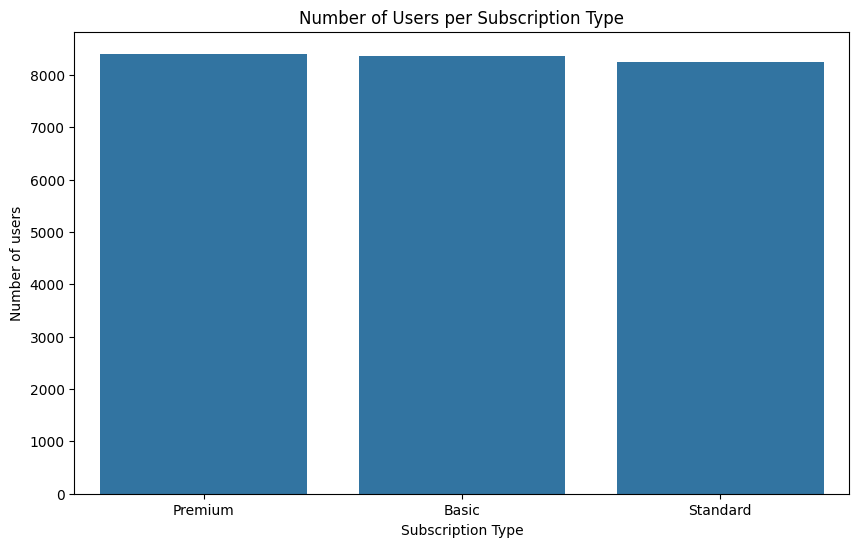
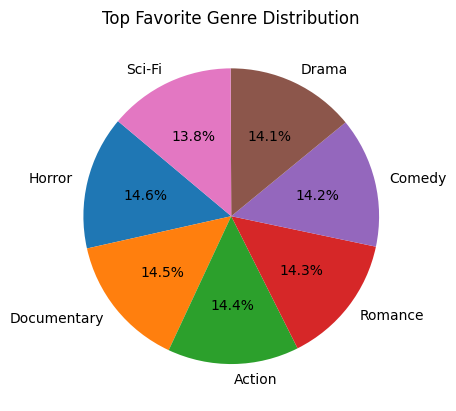
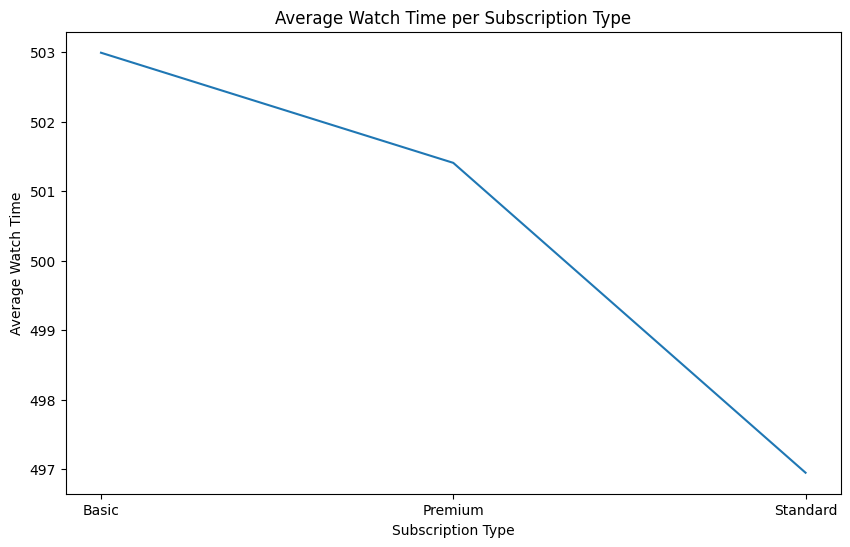
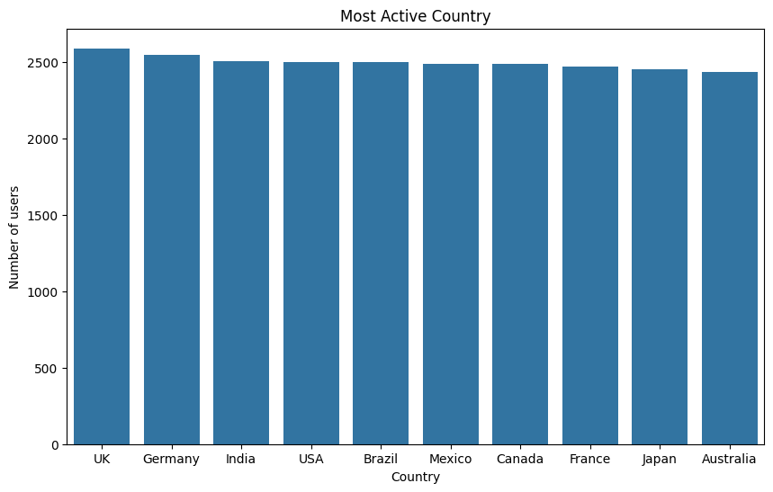

# 📊 Netflix Users Data Analysis

This project explores and visualizes Netflix users data to understand user behavior, subscription preferences, and content interests. The analysis was performed using Python with Pandas, NumPy, Matplotlib, and Seaborn.

---

## 📁 Dataset Overview

The dataset contains the following 8 columns and 25000 rows:

| Column Name         | Description                                  |
|---------------------|----------------------------------------------|
| `User_ID	`         | Unique user ID                               |
| `Name`              | User's name                                  |
| `Age`               | Age of the user                              |
| `Country`           | User's country                               |
| `Subscription_Type` | Type of Netflix subscription (Basic, etc)    |
| `Watch_Time_Hour`   | Total hours watched                          |
| `Favorite_Genre`    | User's favorite content genre                |
| `Last_Login`        | Last login timestamp                         |

---

## 🧰 Tools Used

- Python
- Pandas
- Matplotlib
- Seaborn
- Google Colab

---

## 📊 Key Visualizations

### 🔸 Number of users per Subscription_Type 

---

### 🔸 Favorite Genre Distribution

---

### 🔸Average watch time hours per subscription_type

---

### 🔸 Most Active Country

---

## 🧾 Summary & Key Insights

- ✅ **Premium** is the most popular subscription type among users.
- 📈 **Average watch time** (in hours) by subscription type:
  - Basic: 502.99  
  - Premium: 501.40  
  - Standard: 496.94  
- 🎬 **Horror** is the most preferred favorite genre.
- 🌍 The **UK** has the highest number of users, making it the most active country in this dataset.

---

## 📬 Contact

📧 gauravxv0410@gmail.com
🔗 [LinkedIn](https://www.linkedin.com/in/gauravxv)

---

